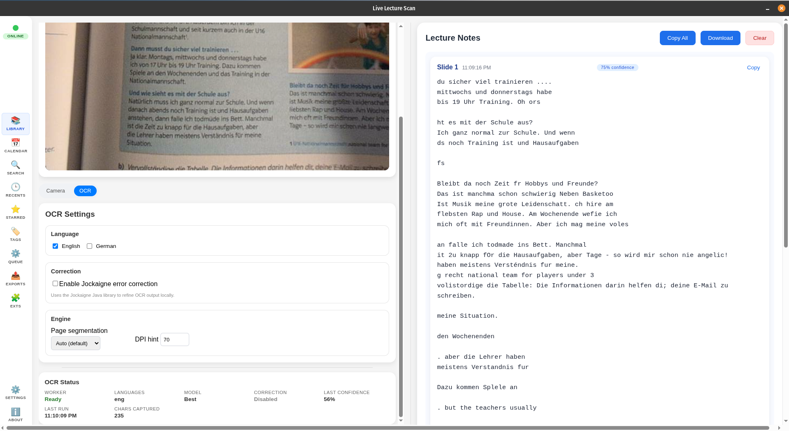
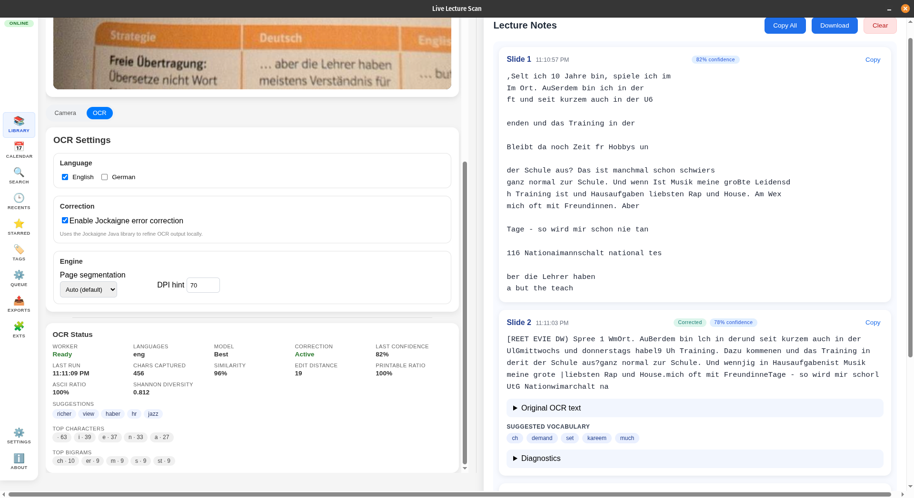

# Live Lecture Scan (LLS)

**Live Lecture Scan** ist eine Desktop-Anwendung zur Echtzeit-Erfassung und -Verarbeitung von Vorlesungsinhalten mittels optischer Zeichenerkennung (OCR). Die Anwendung kombiniert Tesseract.js für die Texterkennung mit der **Jockaigne 1.0** Java-Bibliothek für OCR-Rohtext Nachbearbeitung und Korrektur.

## 📸 Screenshots

<table>
  <tr>
    <td width="33%" align="center">
      
      <br/>
      <b>Hauptansicht</b>
      <br/>
      <sub>Webcam-Feed, Kamera Einstellung, Textanzeige</sub>
    </td>
    <td width="33%" align="center">
      
      <br/>
      <b>OCR-Einstellungen</b>
      <br/>
      <sub>Konfiguration von Sprache, Tesseract Settings und Jockaigne Korrektur</sub>
    </td>
    <td width="33%" align="center">
      
      <br/>
      <b>Jockaigne Diagnostik</b>
      <br/>
      <sub>Jockaigne OCR Diagnostik</sub>
    </td>
  </tr>
</table>

## 📋 Systemanforderungen

### Zur Ausführung der fertigen Anwendung
- **Windows**: Windows 10/11 (64-bit)
- **macOS**: macOS 10.15+ (Intel/Apple Silicon)
- **Linux**: Ubuntu 20.04+ oder äquivalent (64-bit)
- Webcam oder externe Kamera
- ~250 MB freier Speicherplatz

### Zur Entwicklung
- Node.js 22.12.0+
- Java Development Kit (JDK) 24
- npm oder yarn

## 🚀 Installation

### Option 1: Vorgefertigte Releases (Empfohlen)
1. Besuche die [Releases-Seite](https://github.com/abullard1/Live-Lecture-Scan-Electron/releases)
2. Lade die entsprechende Version für dein Betriebssystem herunter:
   - **Windows**: `Live-Lecture-Scan-Setup-1.0.0.exe`
   - **macOS**: `Live-Lecture-Scan-1.0.0.dmg`
   - **Linux**: `live-lecture-scan_1.0.0_amd64.deb` oder `Live-Lecture-Scan-1.0.0.AppImage`
3. Installiere bzw. führe die Anwendung aus

### Option 2: Build from Source
```bash
# Repository klonen
git clone https://github.com/abullard1/Live-Lecture-Scan-Electron.git
cd Live-Lecture-Scan-Electron

# Dependencies installieren
npm install

# Java-Komponenten bauen
npm run build:java

# Entwicklungsserver starten
npm run dev

# Oder: Production Build erstellen
npm run build
npm run dist
```

## 🛠 Technologie-Stack

### Frontend
- **Electron 37.x**: Desktop-App-Framework
- **Vue.js 3.5**: Reaktives UI-Framework
- **Vite 4**: Build-Tool und Dev-Server
- **Tesseract.js 5**: WebAssembly-basierte OCR-Engine

### Backend/Processing
- **Java 24**: Runtime für Textverarbeitung
- **Jockaigne 1.0** (LingoLibry): Bibliothek für Unicode-Textanalyse

### Build & CI/CD
- **electron-builder**: Multi-Platform-Packaging
- **GitHub Actions**: Automatisierte Builds für Windows, macOS, Linux
- **ESLint + Prettier**: Code-Qualität und Formatierung

## 📁 Projektstruktur

```
Live-Lecture-Scan-Electron/
├── src/
│   ├── main/              # Electron Main Process
│   │   └── index.js       # IPC-Handler, Java-Integration
│   ├── preload/           # Preload-Skripte (Context Bridge)
│   └── renderer/          # Vue.js Frontend
│       ├── App.vue        # Haupt-Komponente
│       ├── components/    # UI-Komponenten
│       │   ├── WebcamFeed.vue
│       │   ├── TextDisplay.vue
│       │   ├── OcrStatusPanel.vue
│       │   └── sidebar/   # Sidebar-Navigation
│       └── ocr/           # OCR-Service (Tesseract.js)
├── java/
│   ├── src/               # Java-Quellcode
│   │   └── JockaigneProcessor.java
│   ├── resources/         # Wörterbücher (wordfreq)
│   │   └── corpus/
│   ├── jockaigne-corrector/libs/
│   │   └── Jockaigne-1.0.jar
│   └── dist/              # Kompilierte JARs + Runtime
├── scripts/
│   └── build-jockaigne.mjs  # Java-Build-Skript
├── .github/workflows/     # CI/CD-Pipelines
├── electron.vite.config.js
└── package.json
```

## 🔧 Entwicklung

### Befehle
```bash
# Development-Server mit Hot-Reload
npm run dev

# Production-Build
npm run build

# Java-Komponenten neu bauen
npm run build:java

# Plattform-spezifische Distributionen erstellen
npm run dist:win      # Windows
npm run dist:mac      # macOS
npm run dist:linux    # Linux
```

### Debugging
- **Main Process**: `console.log()` erscheint im Terminal
- **Renderer Process**: F12 öffnet DevTools
- **Java Process**: Logs werden über `stderr` zurückgegeben

## 👨‍💻 Autor

**Samuel Ruairí Bullard**
GitHub: [@abullard1](https://github.com/abullard1)
E-Mail: samuel.ruairi.bullard@gmail.com

Entwickelt im Rahmen des Kurses ***"Jockaigne 1.0 (LingoLibry) für Java - Einführung und Anwendungsbeispiele SS 2025"***, geleitet von Prof. Dr. Jürgen Reischer an der **Universität Regensburg**.

## 📄 Lizenz

MIT License - siehe [LICENSE](LICENSE) für Details.

---

**Hinweis**: Dies ist eine akademische Arbeit. Die Anwendung dient primär zu Demonstrationszwecken und ist nicht für den Live-Production Einsatz intendiert.
